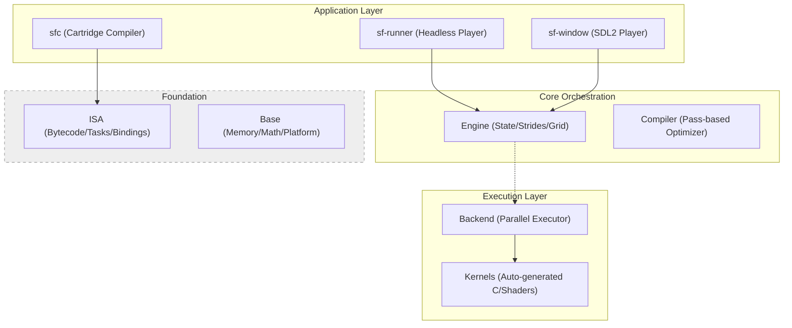

# SionFlow Architecture

SionFlow is a **Data-Oriented Computation Engine**. It is designed to process data streams (Tensors) efficiently by strictly separating the **definition** of logic from its **execution**.

## System Overview

The system is built as a layered hierarchy of modules. Lower layers (Base, ISA) have no dependencies on upper layers.

---

## The Execution Model: Task-Driven

Unlike traditional VMs that interpret instructions one-by-one, SionFlow uses a **Task-Driven** model. 

1.  **Instruction:** A simple 4-address operation (Opcode + Register IDs).
2.  **Task:** A contiguous sequence of instructions that share the same **Execution Domain** (output shape) and **Dispatch Strategy**.
3.  **Binding:** A link between a Register and its N-Dimensional Strides for a specific task.

### Why Tasks?
Tasks allow the Engine to perform expensive work (like calculating strides and memory barriers) once per task, rather than for every instruction. For GPU backends, a **Task** maps directly to a **Compute Shader Dispatch**.

---

## Module Responsibilities

### 1. Foundation Layers

#### **Base** (`sf-spec/base`)
*   **Role:** OS-independent primitives.
*   **Contents:** Memory allocators (Arena/Heap), Shape math, Thread Pool, and atomic error handling.

#### **ISA** (`sf-spec/isa`)
*   **Role:** The Contract. Defines binary formats and metadata.
*   **Contents:** `sf_program`, `sf_instruction`, `sf_task`, and `sf_op_metadata` (arity, type masks).

### 2. Core Orchestration

#### **Compiler** (`sf-compiler`)
*   **Role:** Translates JSON Graphs into optimized Bytecode.
*   **Passes:** Lowering, Fusion, topological sorting, and **Liveness Analysis** (Register Allocation).
*   **Safety:** Strictly validates port connections and shape compatibility using metadata.

#### **Engine** (`sf-runtime/engine`)
*   **Role:** The "Brain" of the Runtime.
*   **Responsibilities:**
    *   **Resource Management:** Handles Global Buffers and Double-Buffering (Ping-Pong).
    *   **Stride Baking:** Pre-calculates byte-strides for every register in every task.
    *   **Dispatching:** Orchestrates the execution sequence and passes prepared "Contexts" to the Backend.

### 3. Execution Layer

#### **Backend** (`sf-backend-cpu`)
*   **Role:** The "Muscle". Implements the actual math.
*   **Architecture:** A "Pure Executor" that receives a list of tasks and a pre-filled `sf_exec_ctx`. It has no knowledge of graph logic or resource names.

---

## Memory Model: Storage vs. View

SionFlow distinguishes between raw data and how it is interpreted.

1.  **sf_buffer (Storage):** A raw block of memory. Owned by the Engine.
2.  **sf_tensor (View):** Metadata (Shape, DType, Offset) + Pointer to a buffer. 
3.  **Registers:** Tensors stored in the `sf_state`. The Compiler optimizes memory usage by aliasing registers (reusing buffers for different tensors with non-overlapping lifetimes).

### Double Buffering (Ping-Pong)
For persistent resources (state that survives between frames), the Engine maintains two buffers: **A (Front)** and **B (Back)**.
*   **Frame N:** Kernels read from **A** and write to **B**.
*   **Post-Frame:** Engine swaps A and B.
This ensures that data is never overwritten while being read, enabling stable feedback loops for physics and animations.

---

## Execution Safety & Diagnostics

### Atomic Kill Switch
The `sf_engine` maintains a global atomic error code. Every execution context (`sf_exec_ctx`) holds a pointer to this flag.
*   **Fault Isolation:** If any thread encounters an error (OOB, Math Error), it sets the global flag.
*   **Immediate Stop:** All other worker threads check this flag before executing the next instruction and stop immediately if it's set.

### Intrinsic Coordinates (The Index System)
SionFlow kernels often need to know "where" they are in the execution domain (e.g., pixel X/Y).
*   **Mechanism:** Special opcodes (`SF_OP_INDEX_X`, etc.) read the current coordinate directly from the `sf_exec_ctx->tile_offset` and `tile_size`.
*   **Zero-Overhead:** These are treated as "Providers" and do not require actual memory storage during the computation.

### Kernel Crash Reports
When a failure occurs, the backend generates a detailed diagnostic report:
*   **Location:** Exact line/column in the source JSON.
*   **Context:** Register values, shapes, and the exact N-Dimensional coordinate where the error happened.
*   **Opcode Trace:** The specific instruction that triggered the fault.

---

## Cartridge Format (.sfc)

A `.sfc` file is a self-contained binary package containing:
*   **Application IR:** Metadata about window, resources, and inputs.
*   **Kernels:** Compiled `sf_program` blocks.
*   **Assets:** Embedded textures, fonts, and data blobs.
*   **Pipeline:** JSON-description of how kernels are connected.